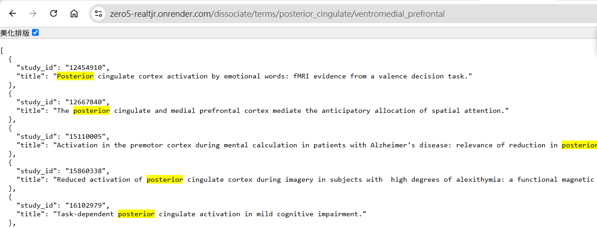

[](https://classroom.github.com/a/SO1PVZ3b)
# Neurosynth Backend

這是一個以 **Flask** 為基礎、連接 **Neurosynth PostgreSQL 資料庫** 的後端系統。  
此服務提供「功能解離 (Functional Dissociation)」相關的 API，  
能夠找出同時出現於一個概念或座標，但未出現於另一個的研究。  
此外，也支援雙向查詢功能（A–B 與 B–A 同時回傳）。

---

## Table of Contents

- [Endpoints](#endpoints)
  - [Dissociate by terms](#dissociate-by-terms)
  - [Dissociate by MNI coordinates](#dissociate-by-mni-coordinates)
  - [延伸功能：雙向查詢](#延伸功能：雙向查詢)
- [Quick Start](#quick-start)
  - [1) Provision PostgreSQL](#1-provision-postgresql)
  - [2) Verify the connection](#2-verify-the-connection)
  - [3) Populate the database](#3-populate-the-database)
  - [4) Run the Flask service](#4-run-the-flask-service)
  - [5) Smoke tests](#5-smoke-tests)
- [Environment Variables](#environment-variables)
- [Example Requests](#example-requests)
- [Requirements](#requirements)
- [Notes](#notes)
- [License](#license)

---

## Endpoints

### Dissociate by terms

```
GET /dissociate/terms/<term_a>/<term_b>
```

回傳出現在 **term_a** 中、但**未出現在** **term_b** 中的研究。

**Examples**


click-> <https://zero5-realtjr.onrender.com/dissociate/terms/language/memory>

click-> <https://zero5-realtjr.onrender.com/dissociate/terms/posterior_cingulate/ventromedial_prefrontal>

**查詢畫面展示**



---

### Dissociate by MNI coordinates

```
GET /dissociate/locations/<x1_y1_z1>/<x2_y2_z2>
```


座標以底線 (`_`) 分隔，表示 `[x, y, z]`。  
此端點回傳出現在第一組座標、但未出現在第二組座標的研究。


**Default Mode Network test case**

click-> <https://zero5-realtjr.onrender.com/dissociate/locations/0_-52_26/-2_50_-6>

click-> <https://zero5-realtjr.onrender.com/dissociate/locations/-2_50_-6/0_-52_26>

> Tip: You may design a single endpoint that returns **both directions** in one response (A–B **and** B–A) if that better suits your client.

### 延伸功能：雙向查詢

除了上述兩個單向查詢外，  
我另外實作了「**雙向查詢端點**」，可同時回傳 A–B 與 B–A 的結果。

```
GET /dissociate/terms_dual/language/memory
GET /dissociate/locations_dual/0_-52_26/-2_50_-6
```
**Examples**

click-> <https://zero5-realtjr.onrender.com/dissociate/terms_dual/language/memory>

click-> <https://zero5-realtjr.onrender.com/dissociate/locations_dual/0_-52_26/-2_50_-6>

---

## Quick Start

### 1) Provision PostgreSQL

Create a PostgreSQL database (e.g., on Render).

### 2) Verify the connection

```bash
python check_db.py --url "postgresql://<USER>:<PASSWORD>@<HOST>:5432/<DBNAME>"
```

### 3) Populate the database

```bash
python create_db.py --url "postgresql://<USER>:<PASSWORD>@<HOST>:5432/<DBNAME>"
```

### 4) Run the Flask service

Deploy `app.py` as a Web Service (e.g., on Render) and set the environment variable:

- `DB_URL=postgresql://<USER>:<PASSWORD>@<HOST>:5432/<DBNAME>`

Use a production server such as Gunicorn as your start command:

```bash
gunicorn app:app --bind 0.0.0.0:$PORT
```

### 5) Smoke tests

After deployment, check the basic endpoints:

- Images: `https://<your-app>.onrender.com/img`
- DB connectivity: `https://<your-app>.onrender.com/test_db`

---

## Environment Variables

- **`DB_URL`** – Full PostgreSQL connection string used by the app.  
  Example: `postgresql://<USER>:<PASSWORD>@<HOST>:5432/<DBNAME>`

> **Security note:** Never commit real credentials to version control. Use environment variables or your hosting provider’s secret manager.

---

## Example Requests

**By terms**

```bash
curl https://<your-app>.onrender.com/dissociate/terms/posterior_cingulate/ventromedial_prefrontal
curl https://<your-app>.onrender.com/dissociate/terms/ventromedial_prefrontal/posterior_cingulate
```

**By coordinates**

```bash
curl https://<your-app>.onrender.com/dissociate/locations/0_-52_26/-2_50_-6
curl https://<your-app>.onrender.com/dissociate/locations/-2_50_-6/0_-52_26
```

---

## Requirements

- Python 3.10+
- PostgreSQL 12+
- Python dependencies (typical):
  - `Flask`
  - `SQLAlchemy`
  - PostgreSQL driver (e.g., `psycopg2-binary`)
  - Production WSGI server (e.g., `gunicorn`)

---

## Notes

- Path parameters use underscores (`_`) between coordinates: `x_y_z`.
- Term strings should be URL-safe (e.g., `posterior_cingulate`, `ventromedial_prefrontal`). Replace spaces with underscores on the client if needed.
- The term/coordinate pairs above illustrate a **Default Mode Network** dissociation example. Adjust for your analysis.

---

## License

This project is licensed under the MIT License. See [LICENSE](LICENSE) for details.
